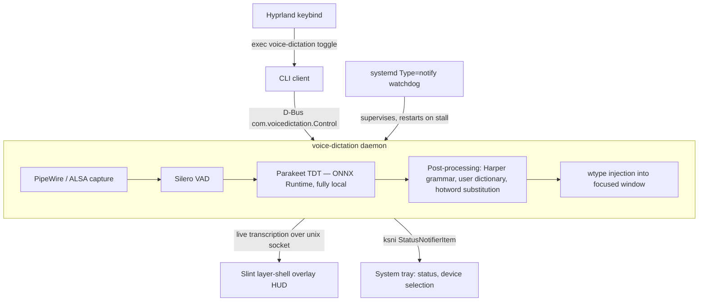
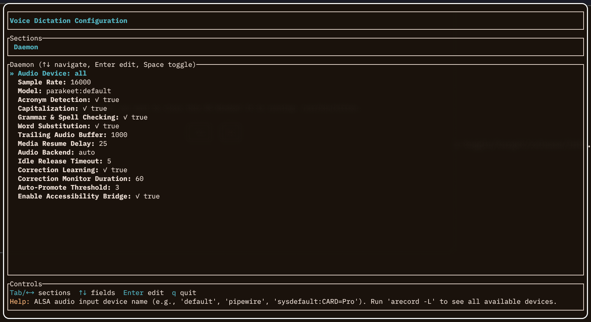

# Hyprland Voice Dictation

Offline voice dictation for Hyprland using NVIDIA Parakeet TDT speech recognition. Press a key to start recording, press again to transcribe and type the result into any focused window.

## Features

- **Offline, private** — all processing runs locally, no cloud API
- **NVIDIA Parakeet TDT 0.6b** — high-accuracy English speech recognition via ONNX Runtime
- **Silero VAD** — voice activity detection to trim silence automatically
- **Harper grammar checker** — optional light grammar correction on transcribed text
- **Slint overlay** — transparent HUD showing recording state and live transcription
- **System tray** — status icon with device selection and quick controls
- **D-Bus control** — clean interface for keybind integration
- **systemd daemon** — persistent background service with watchdog support
- **playerctl integration** — auto-pause/resume media during recording

## How it works

The whole pipeline runs on-device inside one daemon — no audio ever leaves the machine.



## Requirements

- Wayland compositor (Hyprland, Sway, etc.)
- `wtype` — keyboard input injection
- PipeWire or ALSA audio
- ~1.6 GB disk space for the Parakeet model

Optional: `playerctl` for media pause/resume.

## Installation

### Arch Linux

Add the [mason](https://github.com/MasonRhodesDev/arch-repo) pacman repository to `/etc/pacman.conf`:

```ini
[mason]
SigLevel = Optional TrustAll
Server = https://masonrhodesdev.github.io/arch-repo/x86_64
```

Then install:

```bash
sudo pacman -Sy hyprland-voice-dictation
```

### Fedora

```bash
sudo dnf copr enable solaris765/hyprland-voice-dictation
sudo dnf install hyprland-voice-dictation
```

Both packages install the binary to `/usr/bin/voice-dictation`, the systemd
user unit, and the standalone model download script under
`/usr/share/hyprland-voice-dictation/`.

### From source (development)

```bash
git clone https://github.com/MasonRhodesDev/hyprland-voice-dictation
cd hyprland-voice-dictation

make install
```

`make install` builds the release binary, installs it to `~/.local/bin/voice-dictation`,
installs and reloads the systemd user service, restarts the daemon so it runs the binary
you just built, and removes any stale shadow copy (see warning below). Override the
locations if you need to:

```bash
make install BINDIR=/usr/local/bin UNITDIR=/etc/systemd/user
```

To remove everything (your model and config under `~/.config/voice-dictation` are kept):

```bash
make uninstall
```

> **Do not `cargo install --path .`** — that installs to `~/.cargo/bin`, which usually
> precedes `~/.local/bin` on `PATH`. The keybind would then run the `~/.cargo/bin` copy
> while the systemd daemon runs the `~/.local/bin` copy, and a stale shadow there makes
> the keybind silently misbehave. Use `make install`, which keeps a single binary in
> `~/.local/bin`. Run `make doctor` (or `voice-dictation diagnose`) any time the keybind
> seems dead — it reports duplicate binaries on `PATH` and client/daemon skew.
> The packaged installs above are immune to this: they own the single copy in
> `/usr/bin`. Don't mix a dev install with a packaged one.

## Download the Model

The Parakeet model (~1.6 GB) is not included and must be downloaded separately:

```bash
voice-dictation download-model
```

This downloads the model from HuggingFace to `~/.config/voice-dictation/models/parakeet/`. Files already present are skipped.

Alternatively, use the standalone shell script (requires `curl`):

```bash
bash scripts/download-parakeet-model.sh
# or, from a packaged install:
bash /usr/share/hyprland-voice-dictation/download-parakeet-model.sh
```

## Setup

### Start the daemon

```bash
# Enable on login
systemctl --user enable --now voice-dictation

# Check status
systemctl --user status voice-dictation
journalctl --user -u voice-dictation -f
```

### Hyprland keybind

Add to `~/.config/hypr/hyprland.conf`:

```
bind = SUPER, V, exec, voice-dictation toggle
```

Press `Super+V` to start recording. Press again to confirm and type the transcription.

> If the keybind seems to do nothing, run `voice-dictation diagnose` (or `make doctor`).
> The most common causes are a duplicate binary on `PATH` (the bind runs a different one
> than the daemon) or a wedged daemon — `systemctl --user restart voice-dictation` clears
> the latter.

### Other compositors

Any Wayland compositor supporting `wtype` works. Map `voice-dictation toggle` to a key using your compositor's keybind system.

## CLI Usage

```
voice-dictation <COMMAND>

Commands:
  daemon              Start the dictation engine daemon
  start               Start a recording session
  stop                Cancel recording
  confirm             Finalize and type the transcription
  toggle              Start if idle, confirm if recording
  status              Show daemon and subsystem status
  config              Open the configuration TUI
  download-model      Download Parakeet model from HuggingFace
  list-audio-devices  List available audio input devices
  diagnose            Show diagnostics (model paths, audio, config)
  debug list          List saved debug recordings
  debug play FILE     Play a debug recording
```

## Configuration

Run `voice-dictation config` to open the interactive configuration TUI, which covers all daemon settings:



Config file: `~/.config/voice-dictation/config.toml`

```toml
# Audio device (leave empty for system default)
audio_device = ""

# Audio backend: "pipewire" or "alsa"
audio_backend = "pipewire"

# Grammar checking
grammar_check = true
```

Run `voice-dictation diagnose` to inspect the current configuration and model status.

## Troubleshooting

**Daemon not starting:**
```bash
journalctl --user -u voice-dictation -n 50
voice-dictation diagnose
```

**Model missing:**
```bash
voice-dictation download-model
```

**No audio input / wrong device:**
```bash
voice-dictation list-audio-devices
# Then set audio_device in config
voice-dictation config
```

**wtype not found:**
```bash
# Arch
sudo pacman -S wtype
# Fedora
sudo dnf install wtype
```

## Project Structure

```
src/main.rs                   CLI frontend and D-Bus client
dictation-engine/             Core library
  src/lib.rs                  Daemon entry point and state machine
  src/engine/                 Parakeet ONNX inference
  src/audio/                  PipeWire/ALSA capture
  src/vad.rs                  Silero VAD
  src/post_processing/        Grammar and text cleanup
dictation-types/              Shared types
slint-gui/                    Overlay HUD (Slint UI)
dist/
  voice-dictation.service     systemd user unit (packaged payload)
packaging/
  PKGBUILD                    Arch Linux package
  hyprland-voice-dictation.spec  Fedora RPM spec (COPR)
  build-srpm.sh               SRPM builder (vendored cargo deps)
scripts/
  check-deps.sh               Dependency checker
  download-parakeet-model.sh  Standalone model downloader
  list-audio-devices.sh       List audio devices
config-schema.json            Config schema for the TUI
```

## License

Licensed under either of [MIT](LICENSE-MIT) or [Apache 2.0](LICENSE-APACHE) at your option.
